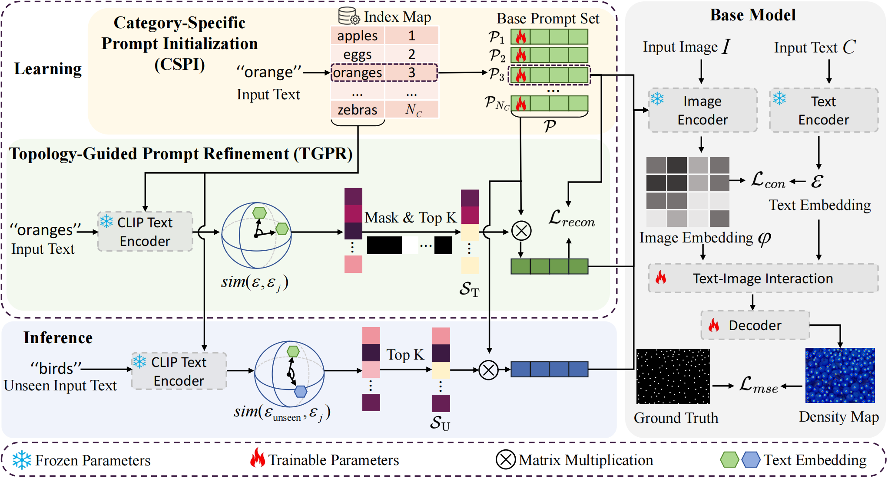

# SDVPT: Semantic-driven Visual Prompt Tuning for Open-world Object Counting



As a plug-and-play framework, this library gives code and pre-training weights for combining with all currently available VLM-based Open-world object counting models (i.e., CountGD, CLIP-Count, VLCounter, CounTX).


## 📋 To-Do List

- [x] Release the test code for SDVPT+CountGD 
- [ ] Release the training code for SDVPT+CountGD 
- [ ] Release the training and test code for SDVPT+CLIP-Count
- [ ] Release the training and test code for SDVPT+VLCounter
- [ ] Release the training and test code for SDVPT+CounTX

## Contents

* [Using SDVPT in CountGD](#using-sdvpt-in-countgd)


## Using SDVPT in CountGD

### 1. Preparation for CountGD

- Enter the working directory
    ```
    cd ./CountGD-SDVPT/CountGD-SDVPT-test
    ```

- Visit [CountGD](https://github.com/niki-amini-naieni/CountGD) and set up the coding environment, bert pre-trained weights, Swin-B GroundingDINO pre-trained weights and dataset as required.

- Download our [pre-trained ckpt for CountGD-SDVPT](https://drive.google.com/uc?export=download&id=1ciNSWt1LkcGI6lXgZKSdKmr4_P0tjUF0) which has similar quantitative result as presented in the paper.

### 2. Run the Code
🧰 **Evaluation**. Test the performance of trained ckpt with following command.  Make sure to change the path of the dataset in the **datasets_fsc147_val.json** and **datasets_fsc147_test.json**.

- For the validation set
```
python -u main_inference.py --output_dir ./test/ -c config/cfg_fsc147_val.py --eval --datasets config/datasets_fsc147_val.json --pretrain_model_path ./path/to/model.ckpt --options text_encoder_type=checkpoints/bert-base-uncased  --simple_crop --num_exemplars 0 
```

- For the test set
```
python -u main_inference.py --output_dir ./test/ -c config/cfg_fsc147_test.py --eval --datasets config/datasets_fsc147_test.json --pretrain_model_path ./path/to/model.ckpt --options text_encoder_type=checkpoints/bert-base-uncased  --simple_crop --num_exemplars 0 
```

## Acknowledgement

This project is based on implementation from [CountGD](https://github.com/niki-amini-naieni/CountGD), [CounTR](https://github.com/Verg-Avesta/CounTR), [VLCounter](https://github.com/Seunggu0305/VLCounter), [CounTX](https://github.com/niki-amini-naieni/CounTX) and [VPT](https://github.com/kmnp/vpt).
