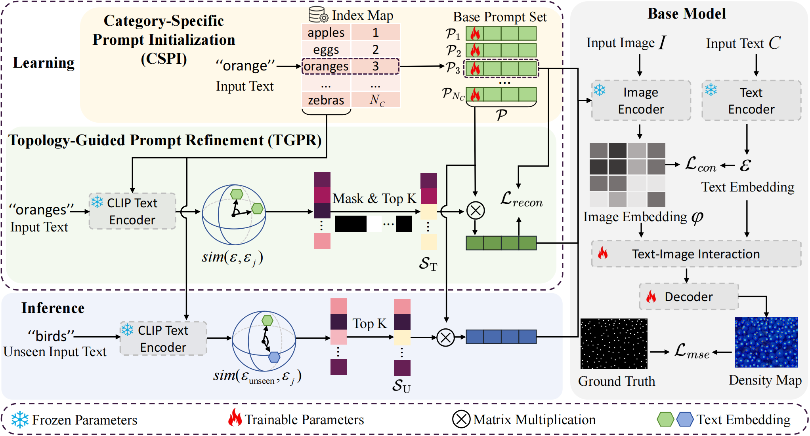

# SDVPT: Semantic-driven Visual Prompt Tuning for Open-world Object Counting



As a plug-and-play framework, this library gives code and pre-training weights for combining with all currently available VLM-based Open-world object counting models (i.e., CountGD, CounTX, VLCounter, CLIP-Count).


## 📋 To-Do List

- [x] Release the test code for SDVPT+CountGD, SDVPT+CounTX, SDVPT+VLCounter and SDVPT+CLIP-Count
- [ ] Release the training code for SDVPT+CountGD, SDVPT+CounTX, SDVPT+VLCounter and SDVPT+CLIP-Count

## Contents

* [Using SDVPT in CountGD](#using-sdvpt-in-countgd)
* [Using SDVPT in CounTX](#using-sdvpt-in-countx)
* [Using SDVPT in VLCounter](#using-sdvpt-in-vlcounter)
* [Using SDVPT in CLIP-Count](#using-sdvpt-in-clip-count)
## Using SDVPT in CountGD

### 1. Preparation for CountGD

- Enter the working directory
    ```
    cd ./CountGD-SDVPT/CountGD-SDVPT-test
    ```

- Visit [CountGD](https://github.com/niki-amini-naieni/CountGD) and set up the coding environment, bert pre-trained weights, Swin-B GroundingDINO pre-trained weights and dataset as required.

- Download our [pre-trained ckpt for CountGD-SDVPT](https://drive.google.com/uc?export=download&id=1ciNSWt1LkcGI6lXgZKSdKmr4_P0tjUF0) which has similar quantitative result as presented in the paper.

### 2. Run the Code
🧰 **Evaluation**. Test the performance of trained ckpt with following command.  Make sure to change the path of the dataset in the **datasets_fsc147_val.json** and **datasets_fsc147_test.json**.

- For the validation set
```
python -u main_inference.py --output_dir ./test/ -c config/cfg_fsc147_val.py --eval --datasets config/datasets_fsc147_val.json --pretrain_model_path ./path/to/model.pth --options text_encoder_type=checkpoints/bert-base-uncased  --simple_crop --num_exemplars 0 
```

- For the test set
```
python -u main_inference.py --output_dir ./test/ -c config/cfg_fsc147_test.py --eval --datasets config/datasets_fsc147_test.json --pretrain_model_path ./path/to/model.pth --options text_encoder_type=checkpoints/bert-base-uncased  --simple_crop --num_exemplars 0 
```

## Using SDVPT in CounTX

### 1. Preparation for CounTX

- Enter the working directory
    ```
    cd ./CounTX-SDVPT
    ```

- Visit [CounTX](https://github.com/niki-amini-naieni/CounTX) and set up the code environment and dataset as required.

    ⚠️ Note that we have modified the **/CounTX-SDVPT/open_clip** folder to include our SDVPT, please do not install the **open_clip_torch** from the original CounTX repository, just use the version we provided in the **./CounTX-SDVPT** folder:

    ```
    pip install ./open_clip
    ```  

- Download our [pre-trained CounTX-SDVPT ckpt](https://drive.google.com/uc?export=download&id=1JLdRYroC87b1kpZGVWc2E2pbb3fSMF-a
) which has similar quantitative result as presented in the paper.


### 2. Run the Code

🧰 **Evaluation**. Test the performance of trained ckpt with following command.  Make sure to change the directory and file path of the dataset in the **get_args_parser()** function of test.py.

```
python test.py --data_split test --output_dir ./test_results --resume ./path/to/model.pth
```


## Using SDVPT in VLCounter

### 1. Preparation for VLCounter

- Enter the working directory
    ```
    cd ./VLCounter-SDVPT
    ```

- Visit [VLCounter](https://github.com/Seunggu0305/VLCounter) and set up the code environment, dataset, CLIP weight, and Byte pair encoding (BPE) file as required.

- Download our [pre-trained VLCounter-SDVPT ckpt](https://drive.google.com/uc?export=download&id=1DD3zl3dIJyHjyemLLw24syWTDfhybRYY) which has similar quantitative result as presented in the paper.

### 2. Run the Code


🧰 **Evaluation**. Test the performance of trained ckpt with following command.  Make sure to check the options in the **test.sh** file. Especially **'--ckpt_used'** to specify the specific weight file.

```
bash scripts/test.sh FSC {gpu_id} {exp_name}
```

## Using SDVPT in CLIP-Count

### 1. Preparation for CLIP-Count

- Enter the working directory
    ```
    cd ./CLIP-Count-SDVPT
    ```

- Visit [CLIP-Count](https://github.com/songrise/clip-count) and set up the code environment and dataset as required.

- Download our [pre-trained CLIP-Count-SDVPT ckpt](https://drive.google.com/uc?export=download&id=1zdIBieHzIJkbz-C-hs48kX-Pf-C4yYvQ) which has similar quantitative result as presented in the paper.

### 2. Run the Code

🧰 **Evaluation**. Test the performance of trained ckpt with following command.
```
python run.py --mode test --exp_name exp --batch_size 32 --dataset_type FSC --ckpt ./path/to/model.ckpt
```


## Acknowledgement

This project is based on implementation from [CountGD](https://github.com/niki-amini-naieni/CountGD), [CounTR](https://github.com/Verg-Avesta/CounTR), [VLCounter](https://github.com/Seunggu0305/VLCounter), [CounTX](https://github.com/niki-amini-naieni/CounTX) and [VPT](https://github.com/kmnp/vpt).
